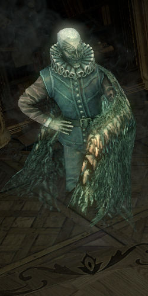

[![Contributors][contributors-shield]][contributors-url]
[![Issues][issues-shield]][issues-url]
[![MIT License][license-shield]][license-url]
[![LinkedIn][linkedin-shield]][linkedin-url]


<!-- PROJECT LOGO -->
<br />
<p align="center">
   
</p>


<!-- TABLE OF CONTENTS -->
## Table of Contents

* [About the Project](#about-the-project)
  * [Built With](#built-with)
* [Getting Started](#getting-started)
  * [Prerequisites](#prerequisites)
  * [Installation](#installation)
* [Usage](#usage)
* [Roadmap](#roadmap)
* [Contributing](#contributing)
* [License](#license)
* [Contact](#contact)
* [Acknowledgements](#acknowledgements)


<!-- ABOUT THE PROJECT -->
## About The Project

Siosa is a python library (atleast intended to be) which can do a lot of tasks inside the
game including trading, inventory management, item rolling, not-afking etc.


### Built With
Python


<!-- GETTING STARTED -->
## Getting Started

Instructions on how to setup the project, it's requirements and things to note during development.

### Prerequisites

This is an example of how to list things you need to use the software and how to install them.
* Python 3.8.5
* Pip (for python 3)
* PyCharm
* Path of exile
* Git
* Github Desktop (optional)

### Project setup

1. Get access to this repo.
2. Go to pycharm and start a new project by cloning from Git.
3. Pycharm should automatically install requirements from requirements.txt file. Pycharm will setup a virtual
environment with these requirements.
4. Enter details in config.json file present in project root.
    5. Enter account name and infromation about stash tabs.
    6. Enter your POE session-id. POE session id can be found [here](siosa/resources/images/poesessionid.png)
5. Create a run configuration in pyCharm. Select module name (siosa).

<!-- USAGE EXAMPLES -->
## Testing
Testing the app -

1. Writing/making-changes to TestTask and TestStep.
    * Make changes to TestTask (or its steps) and submit the TestTask to GameController (this is being done in the app.py right now)
    * Run the app (py -m siosa) or (using pycharm "Run")
2. Using test utils
    * Install the siosa package by running the following command from root of the project
        ```
        pip install -e .
        ```
    * Run any util as usual e.g - 
        ```
        python tools\template_creator.py
        ```

Following things happen - 
1. Stash details are fetched.
2. Currency exchange ratio is fetched for exalt-chaos.
3. InitTask is executed
    1. Window is switched to game.
    2. Zone is changed to HIDEOUT
    3. Stash is placed and opened.
    4. Inventory is cleaned.
4. TestTask is executed.

Read logs for debugging.

<!-- USAGE EXAMPLES -->
## Architecture
TODO

<!-- ROADMAP -->
## Roadmap

See the [open issues](https://github.com/nitinj/siosa/issues) for a list of proposed features (and known issues).


<!-- CONTRIBUTING -->
## Contributing

Contributions are what make the open source community such an amazing place to be learn, inspire, and create. Any contributions you make are **greatly appreciated**.

1. Fork the Project
2. Create your Feature Branch (`git checkout -b feature/AmazingFeature`)
3. Commit your Changes (`git commit -m 'Add some AmazingFeature'`)
4. Push to the Branch (`git push origin feature/AmazingFeature`)
5. Open a Pull Request


<!-- LICENSE -->
## License

Distributed under the MIT License. See `LICENSE` for more information.


<!-- CONTACT -->
## Contact

[@Nitin jaglan](https://twitter.com/your_username) - nitin.jaglan@gmail.com

Project Link: [https://github.com/nitinj/siosa](https://github.com/nitinj/siosa)


<!-- ACKNOWLEDGEMENTS -->
## Acknowledgements
* [Best-README-Template](https://github.com/othneildrew/Best-README-Template)


<!-- MARKDOWN LINKS & IMAGES -->
<!-- https://www.markdownguide.org/basic-syntax/#reference-style-links -->
[contributors-shield]: https://img.shields.io/github/contributors/othneildrew/Best-README-Template.svg?style=flat-square
[contributors-url]: https://github.com/nitinj/siosa/graphs/contributors
[forks-shield]: https://img.shields.io/github/forks/othneildrew/Best-README-Template.svg?style=flat-square
[forks-url]: https://github.com/nitinj/siosa/network/members
[stars-shield]: https://img.shields.io/github/stars/othneildrew/Best-README-Template.svg?style=flat-square
[stars-url]: https://github.com/nitinj/siosa/stargazers
[issues-shield]: https://img.shields.io/github/issues/othneildrew/Best-README-Template.svg?style=flat-square
[issues-url]: https://github.com/nitinj/siosa/issues
[license-shield]: https://img.shields.io/github/license/othneildrew/Best-README-Template.svg?style=flat-square
[license-url]: https://github.com/nitinj/siosa/blob/master/LICENSE.txt
[linkedin-shield]: https://img.shields.io/badge/-LinkedIn-black.svg?style=flat-square&logo=linkedin&colorB=555
[linkedin-url]: https://linkedin.com/in/nitinjaglan